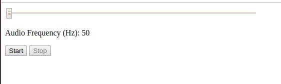

# dtc-web-audio-frequency

&nbsp;

Play sounds of frequencies on web. Go to my website <https://www.huanlezhang.com/gallery.php> to have a brief idea of it.  

Screenshot from Chrome.

For an Android application that has the similar functionality, please refer to my [dtc-frequency-player](https://github.com/dtczhl/dtc-frequency-player)

## Instructions

Default IDs

*   Slider bar: `freqSlider`
*   Slider bar value: `freqValue`
*   Start button: `freqStart`
*   Stop button: `freqStop`

## Browser Tested

*   Chrome
